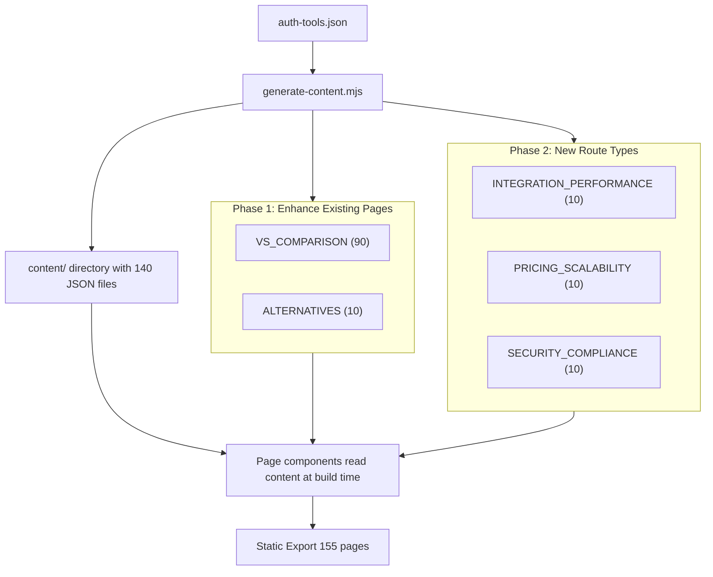

# pSEO Content Engine — Architecture & Implementation Plan

## Project Roadmap



---

## 1. Content Generation Pipeline

### 1.1 Pre-build Script: `scripts/generate-content.mjs`

A Node.js script that runs **before** `next build`, invoked via `npm run precontent`. Currently generates **template/mock content** (no AI API dependency); the architecture is ready to swap in OpenAI/Anthropic by uncommenting the API call block.

**Execution flow:**
```
npm run build  →  verify  →  presitemap  →  precontent  →  next build
```

### 1.2 Content Directory Structure

```
content/
├── types.ts                          # Shared TypeScript interfaces
├── index.ts                          # Re-export all content
├── compare/
│   ├── clerk-vs-kinde.json           # VS_COMPARISON
│   ├── clerk-vs-better-auth.json     # VS_COMPARISON
│   └── ... (90 files)
├── tools/
│   ├── clerk/
│   │   ├── page.json                 # Enhanced page content
│   │   ├── alternatives.json         # ALTERNATIVES
│   │   ├── performance.json          # INTEGRATION_PERFORMANCE
│   │   ├── pricing.json              # PRICING_SCALABILITY
│   │   └── security.json             # SECURITY_COMPLIANCE
│   ├── kinde/
│   │   └── ...
│   └── ... (10 tool directories)
```

### 1.3 Content JSON Schema (per page type)

```typescript
// content/types.ts — matches the JSON schema from input prompt

export interface SeoMetadata {
  meta_title: string;        // <60 chars
  meta_description: string;  // 140-155 chars
  slug: string;
}

export interface HeroSection {
  h1_title: string;
  subtitle: string;
}

export interface StructuredDataPoint {
  metric_label: string;
  tool_1_value: string;
  tool_2_value?: string;     // empty if not a VS page
}

export interface ProsCons {
  pros: string[];
  cons: string[];
}

export interface FaqItem {
  question: string;
  answer: string;
}

// ——— Specific page type content interfaces ———

export interface VsComparisonContent {
  page_type: "VS_COMPARISON";
  tool_1: string;
  tool_2: string;
  seo_metadata: SeoMetadata;
  hero_section: HeroSection;
  structured_data_points: StructuredDataPoint[];
  detailed_analysis_winner: { section_title: string; paragraphs: string[] };
  detailed_analysis_loser: { section_title: string; paragraphs: string[] };
  pros_and_cons: { tool_1: ProsCons; tool_2: ProsCons };
  faq_schema: FaqItem[];
}

export interface AlternativesContent {
  page_type: "ALTERNATIVES";
  tool: string;
  seo_metadata: SeoMetadata;
  hero_section: HeroSection;
  // categories: best open-source, best enterprise, fastest time-to-production
  alternative_categories: {
    category: string;
    explanation: string;
    picks: { name: string; reason: string }[];
  }[];
  faq_schema: FaqItem[];
}

export interface PerformanceContent {
  page_type: "INTEGRATION_PERFORMANCE";
  tool: string;
  seo_metadata: SeoMetadata;
  hero_section: HeroSection;
  bundle_impact: string;
  core_web_vitals: string;
  edge_runtime_notes: string;
  api_route_protection_steps: string[];
  faq_schema: FaqItem[];
}

export interface PricingContent {
  page_type: "PRICING_SCALABILITY";
  tool: string;
  seo_metadata: SeoMetadata;
  hero_section: HeroSection;
  cost_projections: {
    maus: string;
    monthly_cost: string;
    notes: string;
  }[];
  hidden_costs: string[];
  faq_schema: FaqItem[];
}

export interface SecurityContent {
  page_type: "SECURITY_COMPLIANCE";
  tool: string;
  seo_metadata: SeoMetadata;
  hero_section: HeroSection;
  passkeys_webauthn: string;
  multi_tenant: string;
  csrf_xss_mitigations: string;
  database_adapters: string;
  faq_schema: FaqItem[];
}

export type PageContent =
  | VsComparisonContent
  | AlternativesContent
  | PerformanceContent
  | PricingContent
  | SecurityContent;
```

---

## 2. TypeScript Integration

### 2.1 New File: `lib/content-loader.ts`

Utility that reads the generated JSON files at server component render time:

```typescript
// lib/content-loader.ts
import { readFileSync } from "fs";
import { join } from "path";
import type {
  VsComparisonContent,
  AlternativesContent,
  PerformanceContent,
  PricingContent,
  SecurityContent,
} from "@/content/types";

// Base path for generated content files
const CONTENT_DIR = join(process.cwd(), "content");

export function loadVsComparison(toolA: string, toolB: string): VsComparisonContent | null {
  try {
    const path = join(CONTENT_DIR, "compare", `${toolA}-vs-${toolB}.json`);
    return JSON.parse(readFileSync(path, "utf-8"));
  } catch {
    return null;
  }
}

export function loadToolAlternatives(slug: string): AlternativesContent | null {
  try {
    const path = join(CONTENT_DIR, "tools", slug, "alternatives.json");
    return JSON.parse(readFileSync(path, "utf-8"));
  } catch {
    return null;
  }
}

export function loadToolPerformance(slug: string): PerformanceContent | null {
  try {
    const path = join(CONTENT_DIR, "tools", slug, "performance.json");
    return JSON.parse(readFileSync(path, "utf-8"));
  } catch {
    return null;
  }
}

export function loadToolPricing(slug: string): PricingContent | null {
  try {
    const path = join(CONTENT_DIR, "tools", slug, "pricing.json");
    return JSON.parse(readFileSync(path, "utf-8"));
  } catch {
    return null;
  }
}

export function loadToolSecurity(slug: string): SecurityContent | null {
  try {
    const path = join(CONTENT_DIR, "tools", slug, "security.json");
    return JSON.parse(readFileSync(path, "utf-8"));
  } catch {
    return null;
  }
}
```

---

## 3. Page Component Updates

### 3.1 Phase 1: Enhance Existing Pages

#### `app/compare/[slug]/page.tsx` — Updated Architecture

```typescript
// Pseudocode
export async function generateMetadata({ params }) {
  const { slug } = await params;
  const [toolA, toolB] = slug.split("-vs-");
  const content = loadVsComparison(toolA, toolB);
  if (!content) return fallbackMetadata(toolA, toolB);
  
  return {
    title: content.seo_metadata.meta_title,
    description: content.seo_metadata.meta_description,
    alternates: { canonical: `...` },
    openGraph: { ... },
  };
}

export default async function ComparePage({ params }) {
  const { slug } = await params;
  const [toolA, toolB] = slug.split("-vs-");
  const content = loadVsComparison(toolA, toolB);
  // Fall back to deterministic rendering if content not generated yet
  if (!content) return renderDeterministicCompare(toolA, toolB);
  
  return (
    <>
      {/* Use content.seo_metadata, content.hero_section, etc. */}
      {/* Structured data from content.faq_schema */}
      {/* Pros/cons from content.pros_and_cons */}
    </>
  );
}
```

#### `app/tools/[slug]/alternatives/page.tsx` — Updated Architecture

Same pattern: load `AlternativesContent`, fall back to current deterministic data if missing.

### 3.2 Phase 2: New Route Types (3 new)

#### New directory structure:

```
app/
├── performance/
│   └── [slug]/
│       └── page.tsx          ← reads tools/[slug]/performance.json
├── pricing/
│   └── [slug]/
│       └── page.tsx          ← reads tools/[slug]/pricing.json
├── security/
│   └── [slug]/
│       └── page.tsx          ← reads tools/[slug]/security.json
```

Each page:
- `generateStaticParams()` returns all 10 tool slugs
- `generateMetadata()` reads the content JSON for optimized SEO tags
- Renders the content fully in RSC with structured data injection

---

## 4. Content Generation Script

### 4.1 `scripts/generate-content.mjs`

**Algorithm:**

```
FOR each tool in tools:
  FOR each other tool in tools WHERE tool != other:
    generate VS_COMPARISON content → content/compare/{tool}-vs-{other}.json
  generate ALTERNATIVES content → content/tools/{tool}/alternatives.json
  generate PERFORMANCE content → content/tools/{tool}/performance.json     (Phase 2)
  generate PRICING content → content/tools/{tool}/pricing.json            (Phase 2)
  generate SECURITY content → content/tools/{tool}/security.json          (Phase 2)
```

**Generation strategy:**
- Build dynamic prompt per PAGE_TYPE from the auth-tools.json fields
- Currently outputs high-quality template content with deterministic data
- AI API integration ready: uncomment the `callAI()` block and set `OPENAI_API_KEY`
- Each file includes the content JSON schema exactly as specified

### 4.2 Keyword Construction (per user spec)

```javascript
function buildKeywords(pageType, tool1, tool2 = null) {
  switch (pageType) {
    case "VS_COMPARISON":
      return [`${tool1} vs ${tool2}`, "Next.js App Router auth comparison", `${tool1} alternatives`];
    case "ALTERNATIVES":
      return [`${tool1} alternatives`, "Next.js auth tools compared", "best Next.js auth solutions"];
    case "INTEGRATION_PERFORMANCE":
      return [`${tool1} Next.js performance`, `${tool1} middleware session cookies`, `${tool1} bundle size impact`];
    case "PRICING_SCALABILITY":
      return [`${tool1} pricing 2026`, "Next.js auth cost comparison", `${tool1} MAU pricing tiers`];
    case "SECURITY_COMPLIANCE":
      return [`${tool1} passkeys WebAuthn`, `Is ${tool1} secure`, `${tool1} database adapters`];
  }
}
```

---

## 5. Build Pipeline Updates

### 5.1 `package.json` — Updated `build` script

```json
{
  "scripts": {
    "build": "npm run verify && npm run presitemap && npm run precontent && next build",
    "precontent": "node scripts/generate-content.mjs"
  }
}
```

### 5.2 `scripts/generate-sitemap.mjs` — Add new Phase 2 routes

```javascript
// Phase 2: Append to existing routes
for (const tool of tools) {
  routes.push({ path: `/performance/${tool.id}`, priority: 0.7, changefreq: "monthly" });
  routes.push({ path: `/pricing/${tool.id}`, priority: 0.7, changefreq: "monthly" });
  routes.push({ path: `/security/${tool.id}`, priority: 0.7, changefreq: "monthly" });
}
```

Total routes: 111 (current) + 30 (Phase 2) = **141 URLs**.

---

## 6. File-by-File Implementation Order

### Phase 1 (Ordered — each step builds on the previous)

| # | File | Action | Purpose |
|---|------|--------|---------|
| 1 | `lib/types.ts` | Add `AuthTool` fields if needed | Already has current fields |
| 2 | `content/types.ts` | **CREATE** | Shared TypeScript interfaces for all 5 content types |
| 3 | `lib/content-loader.ts` | **CREATE** | Server-side JSON reader for all content types |
| 4 | `scripts/generate-content.mjs` | **CREATE** | The content generation engine (template mock first) |
| 5 | `package.json` | Add `precontent` script | Wire into build pipeline |
| 6 | `app/compare/[slug]/page.tsx` | Update `generateMetadata` + render | Consume `VsComparisonContent` |
| 7 | `app/tools/[slug]/page.tsx` | Update `generateMetadata` + render | Consume enhanced page content |
| 8 | `app/tools/[slug]/alternatives/page.tsx` | Update `generateMetadata` + render | Consume `AlternativesContent` |
| 9 | **BUILD** | `npm run build` | Verify 115 pages, zero errors |

### Phase 2 (After Phase 1 is green)

| # | File | Action | Purpose |
|---|------|--------|---------|
| 10 | `app/performance/[slug]/page.tsx` | **CREATE** | New `/performance/[tool]` route |
| 11 | `app/pricing/[slug]/page.tsx` | **CREATE** | New `/pricing/[tool]` route |
| 12 | `app/security/[slug]/page.tsx` | **CREATE** | New `/security-compliance/[tool]` route |
| 13 | `scripts/generate-content.mjs` | Enable Phase 2 content | Generate performance/pricing/security JSON |
| 14 | `scripts/generate-sitemap.mjs` | Add Phase 2 routes | 30 new URLs |
| 15 | `app/layout.tsx` | Update nav/footer | Link to new pages |
| 16 | **BUILD** | `npm run build` | Verify 145 pages, zero errors |

---

## 7. Architecture Diagram (Component Tree)

```mermaid
flowchart LR
    subgraph Data_Layer["Data Layer"]
        A[auth-tools.json]
        C[content/*.json]
    end
    
    subgraph Loaders["Loaders"]
        B[lib/data.ts]
        L[lib/content-loader.ts]
        T[content/types.ts]
    end
    
    subgraph Pages["Pages"]
        HP[app/page.tsx]
        CP[app/compare/[slug]/page.tsx]
        TP[app/tools/[slug]/page.tsx]
        AP[app/tools/[slug]/alternatives/page.tsx]
        PERF[app/performance/[slug]/page.tsx]
        PRIC[app/pricing/[slug]/page.tsx]
        SEC[app/security/[slug]/page.tsx]
    end
    
    subgraph Components["Components"]
        SM[SchemaMarkup]
        FAQ[FaqSection]
        BC[Breadcrumb]
        BTT[BackToTop]
    end
    
    A --> B
    B --> HP
    B --> CP
    B --> TP
    B --> AP
    
    C --> L
    L --> CP
    L --> TP
    L --> AP
    L --> PERF
    L --> PRIC
    L --> SEC
    
    CP --> SM
    CP --> FAQ
    CP --> BC
    TP --> SM
    TP --> BC
    AP --> SM
    AP --> BC
```

---

## 8. Edge Cases & Fallback Strategy

| Scenario | Fallback Behavior |
|----------|-------------------|
| Content JSON not yet generated | Render deterministic data from `auth-tools.json` directly |
| Missing field in content JSON | TypeScript compilation error (strict type checking) |
| AI API rate limit / error | Template content in `generate-content.mjs` is valid fallback |
| New tool added to `auth-tools.json` without regenerating content | Deterministic rendering keeps site functional |
| OneDrive file lock during content write | `generate-content.mjs` writes to `.content.tmp` then renames atomically |
| Phase 2 pages before Phase 2 content generated | `generateStaticParams` produces no routes → no broken links |

---

## 9. Verification Gates

Each phase ends with a build verification that enforces:

1. **TypeScript strict mode** — `ignoreBuildErrors: false`
2. **All 5 content types** match the JSON schema (validated in `generate-content.mjs`)
3. **meta_title under 60 chars** — validation script checks each content file
4. **meta_description 140-155 chars** — same validation
5. **All hrefs resolve** — no broken internal links (manual + build check)
6. **Quranic verses present** in layout — existing `verify-bismillah.mjs`

---

## 10. Effort Estimation

| Phase | Files | Lines of code | Estimated time |
|-------|-------|---------------|----------------|
| Phase 1: Types + loader + script | 4 new, 4 modified | ~500 new, ~100 modified | 3-4 hours |
| Phase 2: 3 new routes + sitemap | 3 new, 2 modified | ~400 new, ~50 modified | 1-2 hours |
| Verification + debugging | — | — | 1 hour |
| **Total** | **7 new, 6 modified** | **~900 new lines** | **5-7 hours** |
